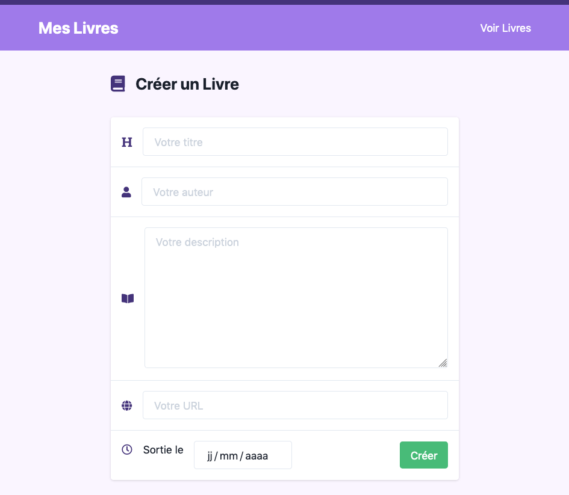
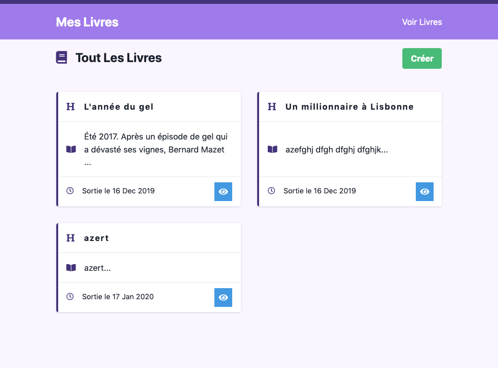
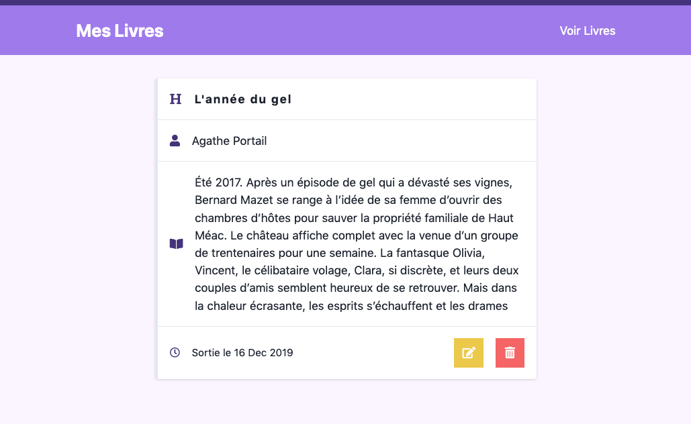
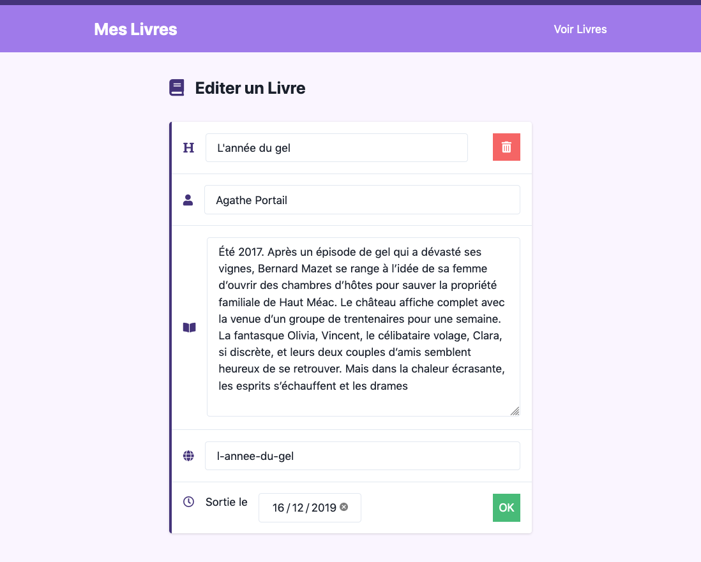

# Evaluation Semestre 1

**Prérequis**: base du PHP, requêtes SQL, architecture MVC

**Objectifs**: Savoir se situer dans ces connaissances depuis le debut de l'année.

Création d'une bibliothèque de livre, avec possibilité de créer, mettre à jour, voir et supprimer un livre.

## Etape 1 - La base de donnée

Créer une base de donnée avec le nom `eval_s1`

Cette table doit avoir les champs suivant:

- id
- title 
- author
- slug 
- description
- date

> ATTENTION: Ne pas oublier les types, index et clé primaire et/ou étrangère

## Etape 2 - La config

Modifier le fichier config.php dans le dossier config pour mettre vos propres informations de base de donnée

## Etape 3 - Créer des livres

Dans cette etape, on va s'interesser à la création de livres

### Router

Créer les routes permettant de de voir la page de création de livre et son enregistrement

> En cas de panne d'inspiration, vous pouvez utiliser la route suivante: `/livres/nouveau`

### controller

Créer le controller appelé par le router ainsi que sa fonction associée

> En cas de panne d'inspiration, vous pouvez appeler le controller: `BookController` et les fonction: `bookCreate()` et `bookStore()`

### Model

Créer le model appelé par le controller ainsi que la fonction appelée par le controller

> En cas de panne d'inspiration, vous pouvez appeler le model: `Book.php` et les fonction: `storeBook()` et `getBook($slug)`

### View

Créer la vue qui affiche le formulaire pour un créer un nouveau livre

Exemple: 

## Etape 4 - Voir tout les livres

Dans cette etape, on va s'occuper d'afficher tout les articles

### Router

Créer les routes permettant de de voir la page où seront affichés les livres

> En cas de panne d'inspiration, vous pouvez utilisé la route suivante: `/livres`

### controller

Créer la fonction appelée par le controller

> En cas de panne d'inspiration, vous pouvez appeler la fonction `bookIndex()`

### Model

Créer le model appelé par le controller ainsi que la fonction appelée par le controller

> En cas de panne d'inspiration, vous pouvez appeler la fonction `getBooks()`

### View

Créer la vue qui affiche le formulaire pour un créer un nouveau livre

Exemple: 

## Etape 5 - Voir un seul livre

Dans cette etape, on va s'occuper d'afficher tout les articles

### Router

Créer les routes permettant de de voir la page où seront affichés les livres

> En cas de panne d'inspiration, vous pouvez utilisé la route suivante: `/livres/{slug}`

### controller

Créer la fonction appelée par le controller

> En cas de panne d'inspiration, vous pouvez appeler la fonction `bookshow($slug)`

### Model

Créer le model appelé par le controller ainsi que la fonction appelée par le controller

> En cas de panne d'inspiration, vous pouvez appeler la fonction `getBook()`

### View

Créer la vue qui affiche le formulaire pour un créer un nouveau livre

Exemple: 

## Etape 6 - Mettre à jour un livres

Dans cette etape, on va s'occuper d'afficher tout les articles

### Router

Créer les routes permettant de de voir la page où seront affichés les livres

> En cas de panne d'inspiration, vous pouvez utilisé la route suivante: `/livres/{slug}/edit`

### controller

Créer la fonction appelée par le controller

> En cas de panne d'inspiration, vous pouvez appeler la fonction `bookEdit($slug)`

### Model

Créer le model appelé par le controller ainsi que la fonction appelée par le controller

> En cas de panne d'inspiration, vous pouvez appeler la fonction `updateBook($slug)`

### View

Créer la vue qui affiche le formulaire pour un créer un nouveau livre

Exemple: 

## Etape 7 - Supprimer un livres

Dans cette etape, on va s'occuper d'afficher tout les articles

### Router

Créer les routes permettant de de voir la page où seront affichés les livres

> En cas de panne d'inspiration, vous pouvez utilisé la route suivante: `/livres/{slug}/delete`

### controller

Créer la fonction appelée par le controller

> En cas de panne d'inspiration, vous pouvez appeler la fonction `bookDelete($slug)`

### Model

Créer le model appelé par le controller ainsi que la fonction appelée par le controller

> En cas de panne d'inspiration, vous pouvez appeler la fonction `deleteBooks($slug)`

### View

Ajouter les formulaire pour supprimer un article dans les vues necéssaire
