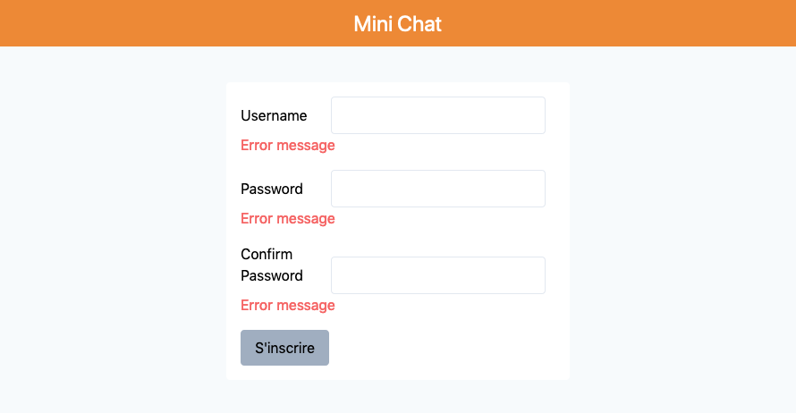
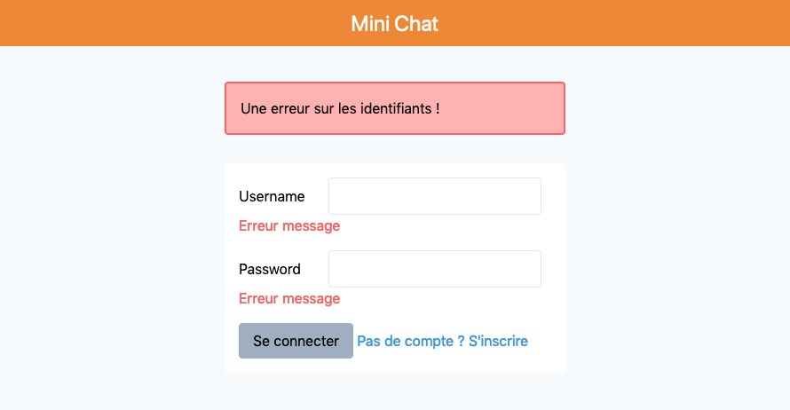
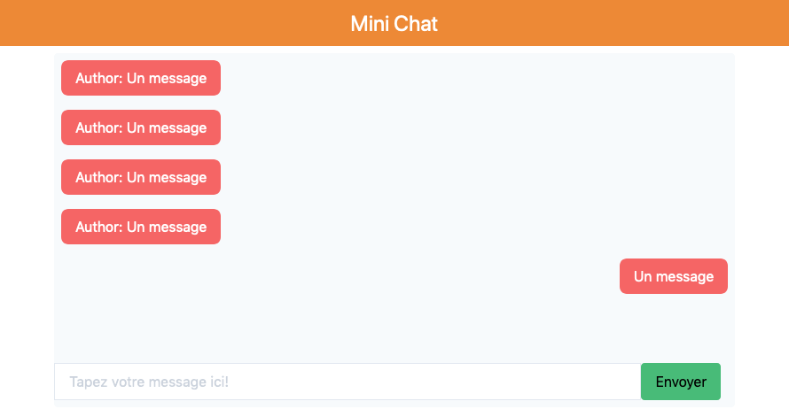

# Mini Chat

**Prérequis**: Base du php, traitement de formulaire, session et bases de données

**Objectifs**: Savoir et Comprendre les processus de communication avec une base de données (CRUD)

Le but de cet exercice est de pouvoir s'inscrire et/ou se connecter afin d'envoyer des messages

## Etape 1

**Cloner le projet**, créer votre **branche** et basculer dessus

## Etape 2 - L'enregistrement d'un utilisateur

Mettre en place le script pour permettre à un utilisateur de s'inscrire.

- S'occuper des erreurs: 
    - le champs username est requis, ne peut contenir uniqument des caractères alpha-numerique et des tirets, et avoir 2 caractères minimum
    - le champs password est requis
    - les champs password et confirm password doivent être égaux
- Enregistrer l'utilisateur en base de données
- Sauvegarder l'utilisateur dans la session

## Etape 3 - La connexion d'un utilisateur

Mettre en place le script pour permettre à l'utilisateur de se connecter

- S'occuper des erreurs: 
    - le champs username est requis, ne peut contenir uniqument des caractères alpha-numerique et des tirets, et avoir 2 caractère minimum
    - le champs password est requis
    - Alerte dans le cas ou les identifiant(username/password) ne sont pas bons
- Sauvegarder l'utilisateur dans la session

## Etape 3 - Les messages

Mettre en place le script pour permettre à l'utilisateur de voir les messages ainsi que d'en créer

- Ne montrer cette page que si l'utilisateur est connecter
- Montrer les messages 
- Enregister les messages en base de données

