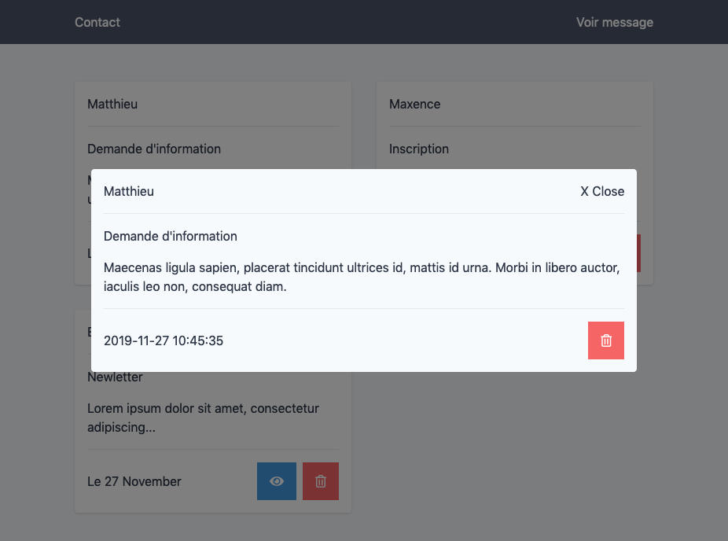

# Evaluation Formulaire, Session et CRUD

**Prérequis**: Gérer les formulaires en php, effectuer des requêtes SQL

**Objectif**: Evaluer ses connaissances

Le but de cette exercice est d'évaluer ses connaissances à travers une situation de formulaire de contact.

Un utilisateur pourra remplir un formulaire, et les informations seront traitées (gestion des erreurs) puis enregistrées en base de données.

L'utilisateur aura aussi la possibilté de voir les messages de contact envoyés, voir le detail, ainsi que supprimer les demandes de contact 

# Etape 0 - base de données

Créer la base de données *evaluation* ainsi que la table *contact*, mettre le code des requêtes sql dans le fichier requetes.md

# Etape 1 - Frontend

Créer un formulaire avec 3 champs:

- Un champ nom
- Un champ sujet
- un champ message qui est requis
- bouton "Envoyer"

Exemple de style: 

# Etape 2 - Traiter le formulaire

Lors de l'envoi du formulaire, effectuer toutes les vérification necessaires:

- Le champ **nom** est requis, doit avoir uniquement des caractères **alphabetique** et des **tirets** et **minimum** 2 caractères
- Le champ **sujet** est requis, doit avoir uniquement des caractères **alpha-numerique** et des **tirets** avec au **minimum** 2 caractères
- Le champ **message** est requis

On affichera les erreurs selon les cas possibles, exemple:

# Etape 3 - La page contact

Sur cette page, l'utilisateur pourra voir l'ensemble des demandes de contact.

Pour chaque demande, on pourra voir le detail de cette demande et supprimer celle-ci

Exemple: 

Exemple de detail:

## Etape 4 - Bonus

- Faire en sorte de pouvoir modifier une demande de contact
- Bloquer l'accès au demande de contact aux users connecté.