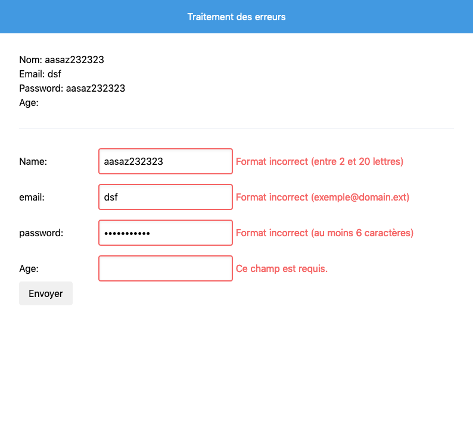
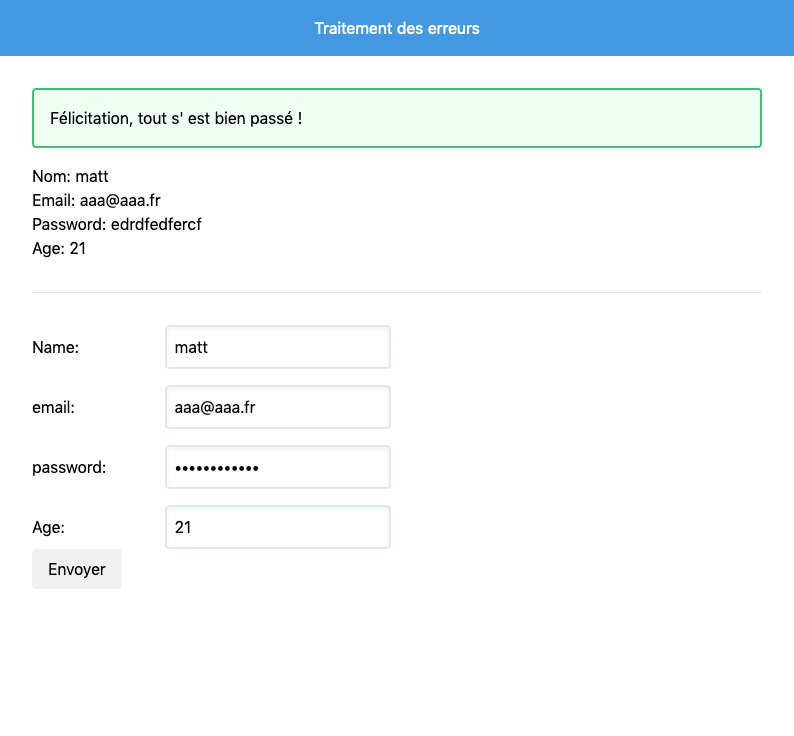
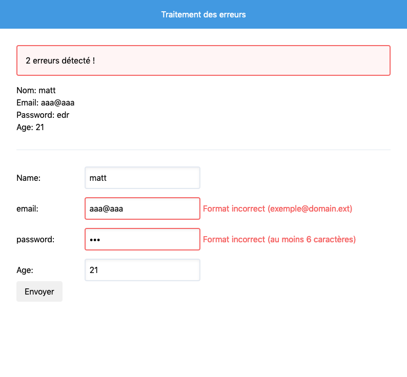

# Formulaires et sessions

**Prérequis**: Bases du php, variables superglobales, expressions régulières

**Objectif**: Savoir traiter un formulaire, afficher les erreurs de soumissions

## Formulaire

Dans un premier temps, on va créer un fomulaire simple avec 4 champs:

- un champ pour le pseudo
- un champ pour l'email
- un champ pour le mot de passe
- un champ pour l'age

Le but de cet exercice sera de traiter les informations envoyées par le formulaire, notamment verifier le format et la validité de ces données.

### Rappel et docs

- [Formulaire - OpenClassroom](https://openclassrooms.com/fr/courses/918836-concevez-votre-site-web-avec-php-et-mysql/913099-transmettez-des-donnees-avec-les-formulaires)
- [Formulaire - W3SCHOOL](https://www.w3schools.com/php/php_forms.asp)
- [Validation](https://www.w3schools.com/php/php_form_validation.asp)
- [Validation](https://www.w3schools.com/php/php_form_required.asp)
- [Validation](https://www.w3schools.com/php/php_form_url_email.asp)
- [Expressions régulières](https://openclassrooms.com/fr/courses/918836-concevez-votre-site-web-avec-php-et-mysql/916990-les-expressions-regulieres-partie-1-2)
- [Sessions et cookies](https://openclassrooms.com/fr/courses/918836-concevez-votre-site-web-avec-php-et-mysql/4239476-session-cookies)

### Exercice

Créer un fichier index.php et écrire un script qui permet de valider les champs de formulaire: 

- le champs *pseudo* est requis, il doit comporter entre 2 et 20 **lettres**
- le champs *email* est requis, et doit suivre le modèle suivant : identifiant@domain.ext
- le champs *password* est requis et doit avoir au moins 6 caractères
- le champs *age* est requis et doit être un nombre entier

Pour chacun des champs, afficher les erreurs en cas de non respect de ces règles. Ainsi que les anciennes valeurs.

Voir exemple:

## Session

Maintenant le formulaire fonctionne mais la logique de validation de celui-ci et son affichage se fait sur le même fichier, ce qui ne sera pas le cas dans les futures applications que l'on va créer.

L'idée est d'enregistrer les données (champs fourni et erreurs) dans la variables superglobale `$_SESSION` pour pouvoir y avoir accès librement dans notre page de formulaire.

On va donc créer un autre fichier qui sera `traitement.php` et qui s'occupera de valider les données saisi, de générer les erreurs si besoin puis de rediriger vers la page de formulaire.

On va créer aussi une alerte en haut de page qui indiquera si la soumission du formulaire s'est bien ou mal passée.

voir exemple:

