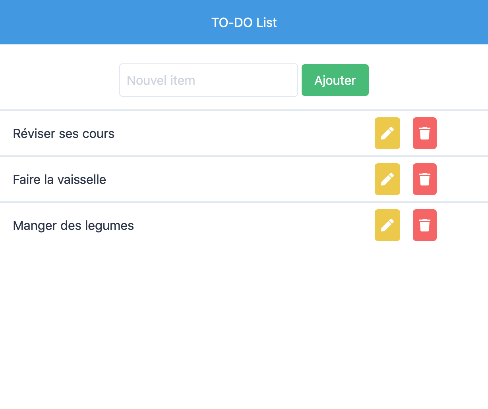
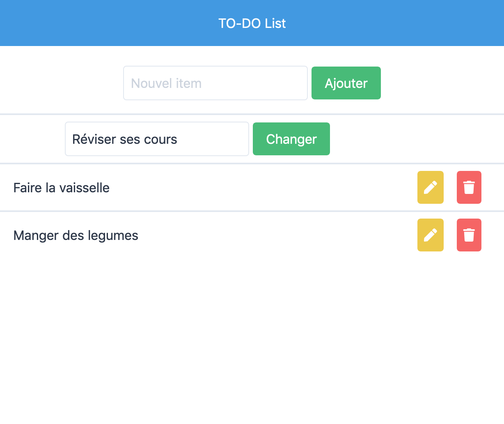

# Les Bases de données

**Prérequis**: Base du php, requêtes mysql
**Objectif**: Communiquer avec une base de données, réaliser les opérations courantes (CRUD)

## Rappel base de données

- [Définitions](https://openclassrooms.com/fr/courses/918836-concevez-votre-site-web-avec-php-et-mysql/913655-quest-ce-quune-base-de-donnees)
- [Connexions](https://openclassrooms.com/fr/courses/918836-concevez-votre-site-web-avec-php-et-mysql/914293-lisez-des-donnees)
- [Lire les données](https://openclassrooms.com/fr/courses/918836-concevez-votre-site-web-avec-php-et-mysql/914293-lisez-des-donnees)
- [Ecrire des données](https://openclassrooms.com/fr/courses/918836-concevez-votre-site-web-avec-php-et-mysql/914508-ecrivez-des-donnees)
- [Modifier les données](https://openclassrooms.com/fr/courses/918836-concevez-votre-site-web-avec-php-et-mysql/914508-ecrivez-des-donnees#/id/r-914477)
- [Supprimer des données](https://openclassrooms.com/fr/courses/918836-concevez-votre-site-web-avec-php-et-mysql/914508-ecrivez-des-donnees#/id/r-914507)

## Exercice

Afin de s'entrainer à communiquer avec une base de données, on va créer une **TO-DO List** simple.

On pourra ainsi: 

- Voir la liste
- Ajouter une chose à faire
- Modifier une chose à faire
- Effacer une chose à faire

### Etape 1

Tout d'abord, il faudra se connecter à la base de donnée.

- Créer une base de données
- Ajouter dans le script php le code de la connexion à cette base.

### Etape 2

Création d'une chose à faire.

- Valider les données saisi par l'utilisateur
- Enregistrer ces données dans la base

## Etape 3

Voir la liste des choses à faire

- récuperer toute la liste de choses à faire
- Les afficher correctement

## Etape 4

Modifier la liste des choses à faire

- Valider les données saisi par l'utilisateur
- Modifier la base avec les nouvelles informations

## Etape 5

Supprimer une chose à faire 

- Supprimer la chose à faire de la base
