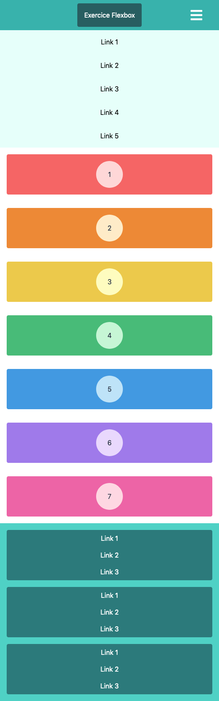
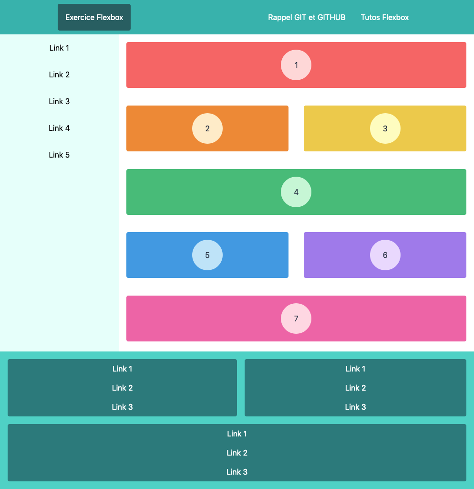
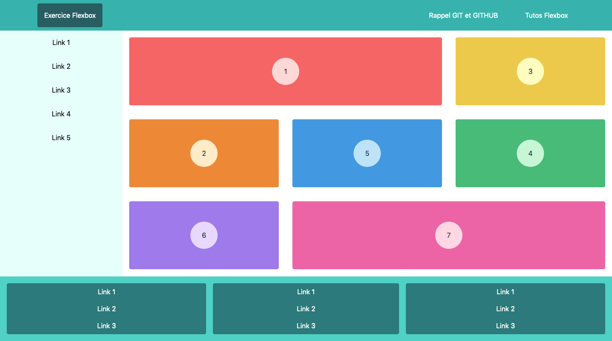

# Exercice FLEXBOX

**Prérequis**: Bases CSS, media queries, responsive design

**Objectif**: Apprendre le positionnement avec flexbox, l'utilisation des media queries et le responsive design

> ATTENTION: Il est interdit de modifier la structure HTML, seul l'ajout de classe et/ou id sont autorisés!

> De plus, le positionnement devra se faire uniquement avec FLEXBOX

## Etape 1

- **Cloner** le repot Github: [Repository Flexbox CSS](https://github.com/EdenSchoolFrance/Lyon-flexbox-css.git)
- **Créer** une branche sous la forme: NOM_PRENOM
- **Basculer** sur la branche nouvellement crée
- Pour **chaque étapes** de l'exercice, **committer** votre travail (**obligatoire**) et pusher le sur **GITHUB** (**optionel**)

## Etape 2 - Mobile

Reproduire le design pour les **mobiles**

## Etape 3

Reproduire le design pour les **tablettes**

## Etape 4

Reproduire le design pour les **ordinateurs**

## Etape 5 bonus

Refaire la même chose mais avec CSS grid

> Note: ne pas effacer le travail précedemment éffectué mais utiliser GIT!
>
> Conseil:
>- revenir sur le premier commit
>- créer une branche "NON_PRENOM_BIS" et basculer dedans
>- travailler